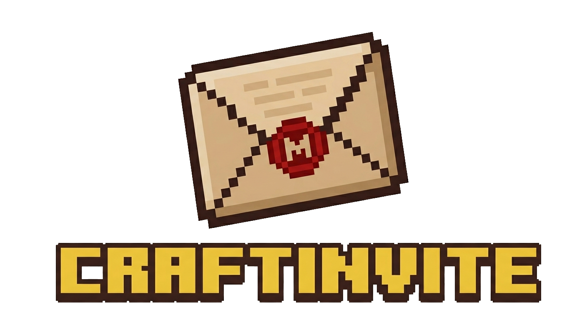

<div align="center">


</div>
> Sistema de invitaciones personalizadas para servidores de Minecraft. Genera links únicos para cada jugador, con un visor 3D de su skin, la IP de tu servidor y un botón de Discord.

<p align="center">
  
  
  
  
</p>

---

## ✨ ¿Qué hace?

En vez de enviarle una IP genérica a tus jugadores, mándales una **carta de invitación animada** con:

- Su **skin de Minecraft renderizada en 3D** (interactiva, rotable, con animación de caminata)
- La **IP de tu servidor** con botón de copiado con un click
- Un botón flotante de **Únete al Discord**
- Su nombre en el sello del sobre

Cada invitación está vinculada a un **token único de 32 caracteres hex**, así que cada link es personal y exclusivo.

---

## 📸 Preview

| Sobre cerrado | Carta abierta |
|---|---|
| El jugador ve un sobre flotante sellado con su nombre | Al hacer click el sobre se abre y aparece su skin 3D, la IP del servidor y el botón de Discord |

---

## 🚀 Inicio Rápido

### Requisitos

- PHP 8.0+
- MySQL o MariaDB
- Servidor web (Apache, Nginx, etc.)
- Extensión PDO de PHP habilitada

### Instalación

**1. Clona el repositorio**

```bash
git clone https://github.com/dev-vixo/CraftInvite.git
```

Sube los archivos a la raíz de tu servidor web (public_html, www, htdocs, etc.) de modo que quede así:

```
public_html/
├── config/
├── admin/
├── assets/
├── index.php
└── vixodevs_tulacraft.sql
```

**2. Crea la base de datos e importa el SQL**

Crea una base de datos vacía desde phpMyAdmin o CLI, luego importa:

```bash
mysql -u tu_usuario -p tu_base_de_datos < vixodevs_tulacraft.sql
```

O desde phpMyAdmin: selecciona tu base de datos → pestaña **Importar** → elige `vixodevs_tulacraft.sql`.

**3. Configura la conexión a la base de datos**

Edita `config/db.php` con los datos de tu hosting:

```php
$host = 'localhost';
$db   = 'tu_base_de_datos';
$user = 'tu_usuario_db';
$pass = 'tu_contraseña_db';
$charset = 'utf8mb4';
```

**4. Cambia la contraseña del admin**

Las credenciales por defecto que trae `vixodevs_tulacraft.sql` son:
- **Usuario:** `Admin`
- **Contraseña:** `Admin123`

⚠️ **Cámbiala inmediatamente.** Crea un archivo PHP temporal en la raíz, ejecútalo una sola vez y luego bórralo:

```php
<?php
echo password_hash('tu_nueva_contraseña', PASSWORD_DEFAULT);
```

Copia el hash generado y actualiza el campo `password_hash` de la tabla `admins` en phpMyAdmin o con:

```bash
mysql -u tu_usuario -p tu_base_de_datos -e \
  "UPDATE admins SET password_hash='HASH_GENERADO' WHERE username='Admin';"
```

**5. Inicia sesión en el dashboard**

```
https://tu-dominio.com/admin/login.php
```

---

## 🎯 Cómo usar

### Invitar a un jugador

1. Inicia sesión en el panel de administración (`admin/login.php`).
2. En la sección **Invitar Nuevo Jugador**, escribe el nombre de Minecraft del jugador.
3. Opcionalmente sube una skin personalizada en formato PNG.
4. Haz click en **Generar Token** — se crea un link de invitación único.
5. Copia el link desde la tabla **Jugadores Activos** (`index.php?t=TOKEN`) y envíaselo al jugador.

### Actualizar configuración del servidor

En la sección **Configuración del Servidor** del dashboard puedes cambiar:
- La **IP del servidor** que se muestra en la carta de invitación
- El **link de Discord** del botón flotante

Los cambios surten efecto de inmediato en todas las páginas de invitación activas.

### Eliminar un jugador

En la tabla de **Jugadores Activos**, haz click en **Borrar** en la fila del jugador. El sistema pedirá confirmación antes de eliminarlo.

---

## 🗂️ Estructura del Proyecto

```
craftinvite/
├── config/
│   ├── db.php              # Conexión PDO a la base de datos (charset utf8mb4)
│   └── security.php        # CSRF, rate limiting, función sanitize()
│
├── admin/
│   ├── auth_check.php      # Middleware: redirige a login.php si no hay sesión activa
│   ├── dashboard.php       # Panel admin: gestión de jugadores y configuración del servidor
│   ├── login.php           # Formulario de inicio de sesión con protección CSRF y rate limiting
│   ├── logout.php          # Destrucción segura de sesión y cookie
│   └── assets/
│       └── js/
│           └── admin.js    # Copiar link de invitación al portapapeles
│
├── assets/
│   ├── img/
│   │   ├── logo.png        # Logo del servidor (aparece en la carta y el dashboard)
│   │   └── Tula_Logo.ico   # Favicon
│   └── skins/              # Skins subidas por el admin (PNG, nombradas skin_TOKEN.png)
│
├── index.php               # Página pública de invitación (?t=TOKEN)
└── vixodevs_tulacraft.sql  # Schema de la BD: tablas admins, players, settings, login_attempts
```

---

## 🔐 Seguridad

| Amenaza | Protección |
|---|---|
| SQL Injection | Prepared statements con PDO en todo el proyecto (`ATTR_EMULATE_PREPARES => false`) |
| XSS | `htmlspecialchars()` con `ENT_QUOTES` y `UTF-8` en todos los outputs |
| CSRF | Token de sesión con 32 bytes aleatorios verificado con `hash_equals()` en todos los POST |
| Fuerza Bruta | Rate limiting: 5 intentos por IP en los últimos 15 minutos (900 seg), registrado en tabla `login_attempts` |
| Session Fixation | `session_regenerate_id(true)` al iniciar sesión correctamente |
| Uploads maliciosos | Verificación real del MIME type con `finfo(FILEINFO_MIME_TYPE)` — solo `image/png` permitido |
| Almacenamiento de contraseñas | bcrypt con `password_hash()` / `password_verify()` |
| Errores expuestos | `display_errors = 0` en producción, los errores solo se loggean con `error_log()` |

---

## ⚙️ Personalización

### Cambiar los colores del servidor

Edita las variables CSS al inicio de `index.php`:

```css
:root {
    --bg-color: #121212;              /* Fondo de la página */
    --card-bg:  #1e1e1e;              /* Fondo de la carta */
    --accent:   #dca337;              /* Color de acento principal */
    --Color1:   rgba(254, 254, 7, 0.7); /* Color del título "Bienvenido" */
    --Color2:   #72bd4cff;            /* Color del botón COPIAR */
    --text:     #ffffff;              /* Color del texto general */
}
```

### Usar un logo personalizado

Reemplaza estos dos archivos con el logo y favicon de tu servidor:
- `assets/img/logo.png` — aparece tanto en la carta de invitación como en el dashboard
- `assets/img/Tula_Logo.ico` — favicon del navegador

### Skin por defecto

Si no se sube una skin para un jugador, `index.php` obtiene automáticamente la skin desde [Minotar](https://minotar.net/) usando su nombre de Minecraft:

```php
$skinUrl = 'https://minotar.net/skin/' . sanitize($player['username']);
```

---

## 🛠️ Stack Tecnológico

- **Backend:** PHP 8, PDO/MySQL con `utf8mb4`
- **Frontend:** HTML5, CSS3, JavaScript ES6 vanilla
- **Renderizado 3D de Skins:** [skinview3d](https://github.com/bs-community/skinview3d) — animación `WalkingAnimation`, autorotación y zoom habilitados
- **Skins por defecto:** [Minotar API](https://minotar.net/)

---

## 🤝 Contribuir

¡Las contribuciones son bienvenidas! Abre un issue o un pull request.

Ideas para futuras mejoras:
- [ ] Envío de links por correo
- [ ] Fechas de expiración para invitaciones
- [ ] Múltiples cuentas de administrador
- [ ] Preview de skin en el dashboard
- [ ] Toggle de tema oscuro/claro en el dashboard
- [ ] Mensajes personalizados por jugador en la carta

---

## 📄 Licencia

MIT License — libre de usar, modificar y distribuir. Ver [LICENSE](LICENSE) para más detalles.

---

*Hecho con ❤️ para la comunidad de Minecraft.*
